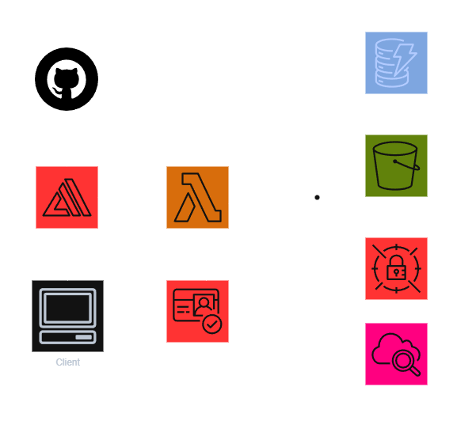

## Project Overview
Serverless AWS application demonstrating managed services, CI/CD via AWS Amplify, and backend integration with AWS services for a math-focused workflow. The repository is named **aws-serverless-app** and runs a stable deployment through Amplify.

## Architecture Overview

User requests are routed through AWS Amplify, authenticated with Amazon Cognito, processed by AWS Lambda, and persisted or enriched through supporting AWS services.

## Deployment Flow
- GitHub repository is connected to AWS Amplify for continuous delivery.
- Amplify builds and hosts the entire application (frontend and backend assets).
- Backend logic executes in AWS Lambda.

## AWS Services Used
- **AWS Amplify**: Hosting and CI/CD for the application.
- **Amazon Cognito**: User authentication for the front end.
- **AWS Lambda**: Containerized Python backend that handles tutoring logic and integrations.
- **Amazon DynamoDB**: Stores chat sessions and usage data.
- **AWS Secrets Manager**: Manages API keys and payment configuration.
- **Amazon S3** (optional): Stores profile assets when enabled.
- **Amazon ECR**: Hosts the Lambda container image.
- **Amazon CloudWatch**: Captures logs and deployment diagnostics.

## Observability & Stability
- CloudWatch logging is enabled for backend execution and deploy visibility.
- Deployment issues are resolved by rolling back or cleaning up failed releases before re-deploying.

## Notes
- Personal cloud engineering project maintained for learning and demonstration purposes.
